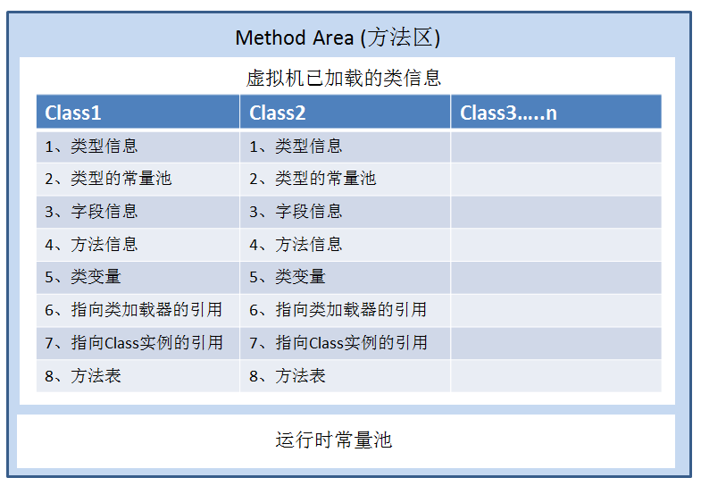

# 1. 前言
最近在研究Java语言底层基础知识，发现对于JVM 内存模型理解不够深入。笔者突发奇想深入理解JVM内存模型，特在此介绍详细介绍一下JVM内存模型中的方法区。看似名称叫做方法区，其实不然。它存放了一些类加载基本信息、常量、静态变量以及编译后的代码等数据。下面我们来详细看一下其中的内容。运行时常量池也可以包含再方法区中，运行时常量池存放的是编译期间生成的各种字面量以及符号引用。关于字面量与符号引用的知识，笔者不再详细介绍。
# 2. 方法区
方法区是线程共享的，它存储已经被虚拟机加载的类信息、常量、静态变量、即时编译器编译后的代码等等。（HotSpot虚拟机上开发部署人员更愿意成为“永久代”，Permanent Generation）。示意图如下：

## 1. 类型信息
* 类型的全限定名
* 超类的全限定名
* 直接超接口的全限定名
* 类型标志（该类是类类型还是接口类型）
* 类的访问描述符（public、private、default、abstract、final、static）
## 2.类型的常量池
存放该类型所用到的常量的有序集合，包括直接常量（如字符串、整数、浮点数的常量）和对其他类型、字段、方法的符号引用。常量池中每一个保存的常量都有一个索引，就像数组中的字段一样。因为常量池中保存中所有类型使用到的类型、字段、方法的字符引用，所以它也是动态链接的主要对象（在动态链接中起到核心作用）。
## 3. 字段信息（该类声明的所有字段）
* 字段修饰符（public、protect、private、default）
* 字段的类型
* 字段名称
## 4.方法信息
方法信息中包含类的所有方法，每个方法包含以下信息：
* 方法修饰符
* 方法返回类型
* 方法名
* 方法参数个数、类型、顺序等
* 方法字节码
* 操作数栈和该方法在栈帧中的局部变量区大小
* 异常表
## 5.类变量（静态变量）
指该类所有对象共享的变量，即使没有任何实例对象时，也可以访问的类变量。它们与类进行绑定。
## 6.指向类加载器的引用
每一个被JVM加载的类型，都保存这个类加载器的引用，类加载器动态链接时会用到。
## 7.指向Class实例的引用
类加载的过程中，虚拟机会创建该类型的Class实例，方法区中必须保存对该对象的引用。通过Class.forName(String className)来查找获得该实例的引用，然后创建该类的对象。
## 8.方法表
为了提高访问效率，JVM可能会对每个装载的非抽象类，都创建一个数组，数组的每个元素是实例可能调用的方法的直接引用，包括父类中继承过来的方法。**JVM对每个加载的非虚拟类的类型信息中都添加了一个方法表，方法表是一组对类实例方法的直接引用(包括从父类继承的方法)**。
## 9.运行时常量池(Runtime Constant Pool)
常量池，用于存放编译器生成的各种字面常量和符号引用，这部分内容被类加载后进入方法区的运行时常量池中存放。运行时常量池相对于Class文件常量池的另外一个特征具有动态性，可以在运行期间将新的常量放入池中（典型的如String类的intern()方法）。